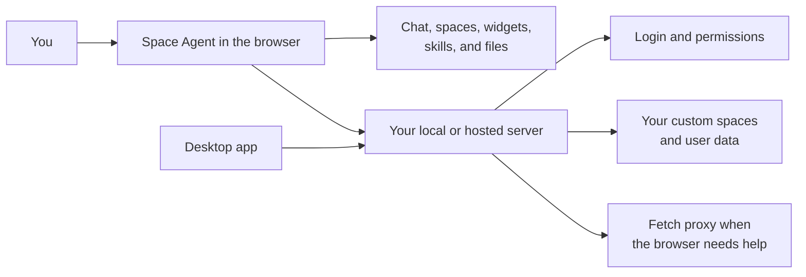

<p align="center">
  <a href="https://space-agent.ai"></a>
</p>

<h1 align="center">Space Agent</h1>

<p align="center">
  <strong>Your personal AI workspace, running completely in the browser on your machine.</strong>
</p>

<p align="center">
  <a href="https://space-agent.ai"></a>
  <br />
  <br />
  <a href="https://github.com/agent0ai/space-agent/releases/latest"></a>
  <a href="#host"></a>
</p>

<p align="center">
  Created by <a href="https://agent-zero.ai"><strong>Agent Zero</strong></a>
  &nbsp;|&nbsp;
  <a href="https://discord.gg/B8KZKNsPpj">Discord</a>
  &nbsp;|&nbsp;
  <a href="https://www.youtube.com/@AgentZeroFW">YouTube</a>
</p>

<p align="center">
  <a href="https://deepwiki.com/agent0ai/space-agent"></a>
  <a href="https://github.com/agent0ai/space-agent/blob/main/LICENSE"></a>
  
  
</p>

---

## Meet Space Agent

Space Agent is an AI control room you can open in a normal browser. Chat with your agent, build spaces, add widgets, manage files, try local models, and keep the whole experience close to your machine.

It is made for people who want an agent they can actually own: run it live, download the app, or host it yourself with a few commands.

<table>
  <tr>
    <td align="center" width="33%">
      
      <br />
      <strong>Your agent, on screen</strong>
      <br />
      A visible assistant that lives in the workspace with you.
    </td>
    <td align="center" width="33%">
      
      <br />
      <strong>App or self-hosted</strong>
      <br />
      Use the desktop app or run your own server.
    </td>
    <td align="center" width="33%">
      
      <br />
      <strong>Built for AI teamwork</strong>
      <br />
      <code>AGENTS.md</code> and DeepWiki help agents understand the project.
    </td>
  </tr>
</table>

## Why It Feels Different

- **It runs where you work.** The agent experience runs in the browser on the client side, so the main workspace stays fast, inspectable, and easy to shape.
- **It is yours to extend.** Add pages, skills, widgets, spaces, and custom behavior without turning the project into a giant backend service.
- **It can stay local.** Run the desktop app, bind it to localhost, or self-host it for your own users.
- **It respects layers.** Core code, group customizations, and user customizations live in separate layers so personal changes do not have to fight the base system.
- **It documents itself for humans and AI.** The repo uses an `AGENTS.md` documentation hierarchy plus DeepWiki so both contributors and AI agents can find the right source of truth.

## How It Works



For people building on it, the useful landmarks are:

- `/` - main workspace
- `/admin` - admin console
- `/login` - sign in
- `/enter` - launcher
- `/api/<endpoint>` - server APIs
- `/mod/...` - browser-loaded features and assets
- `L0`, `L1`, and `L2` - core, group, and user layers

## What You Can Do

<table>
  <tr>
    <td width="50%">
      <h3>Build your own AI space</h3>
      <p>Create dashboards, add widgets, save files, test models, and keep the agent close to the work instead of trapped in a separate chat tab.</p>
      <p>Space Agent is meant to feel like a personal command deck: practical, visual, and yours to reshape.</p>
    </td>
    <td align="center" width="50%">
      
    </td>
  </tr>
  <tr>
    <td align="center" width="50%">
      
    </td>
    <td width="50%">
      <h3>Run it your way</h3>
      <p>Try it live, install the app, or host it yourself. The same project can be a personal local tool or a shared server for a team.</p>
      <p>Admin mode gives operators a place to manage users, files, modules, and agent settings.</p>
    </td>
  </tr>
</table>

## Quick Start

### Run Locally Via App

Download the latest desktop build from the [GitHub Releases page](https://github.com/agent0ai/space-agent/releases/latest). The app starts the local runtime for you and opens Space Agent without making you manage a server by hand.

<a id="host"></a>

### Host Yourself As A Server

Clone it, install dependencies, set a durable customware path, create an admin, and start the production-ready zero-downtime server with auto-update.

```bash
# clone, open, install dependencies
git clone https://github.com/agent0ai/space-agent.git
cd space-agent
npm install

# keep users, groups, and personal spaces outside the source checkout
node space set CUSTOMWARE_PATH=/srv/space-agent/customware

# create administrator user
node space user create admin --password "change-me-now" --full-name "Admin" --groups _admin

# production-ready zero-downtime server with auto-update enabled by default
node space supervise HOST=0.0.0.0 PORT=3000
```

Open:

- App: `http://localhost:3000/`
- Admin: `http://localhost:3000/admin`

For simple local source-checkout runs without the supervisor, use `node space serve`:

```bash
node space serve
```

`node space supervise` requires `CUSTOMWARE_PATH`. It runs the public server as a proxy, starts replaceable `space serve` children on private loopback ports, restarts the active child if it crashes, stages source updates in release directories, switches only after the replacement is healthy, and drains old streams before cutting the old instance off. Auto-update checks run every 300 seconds by default; use `--auto-update-interval 0` when you want crash-restart supervision without update checks.

For larger multi-instance deployments, use the same `SPACE_AUTH_PASSWORD_SEAL_KEY` and `SPACE_AUTH_SESSION_HMAC_KEY` values on every instance so logins keep working across them.

### Admin User Cheatsheet

Create another admin user:

```bash
node space user create alice --password "replace-this" --full-name "Alice" --groups _admin
```

Reset a password:

```bash
node space user password alice --password "new-password"
```

Start in single-user local mode with implicit `_admin` access:

```bash
node space serve SINGLE_USER_APP=true
```

## Useful Commands

| Command | Purpose |
| --- | --- |
| `node space serve` | Start Space Agent. |
| `node space supervise` | Run the production-ready zero-downtime server with auto-update and crash restart. |
| `node space get` | Show saved settings. |
| `node space set KEY=VALUE [KEY=VALUE ...]` | Save one or more settings in `.env`. |
| `node space user create` | Create a user, with optional `--groups`. |
| `node space user password` | Reset a user's password and clear sessions. |
| `node space group create` | Create an `L1/<group>` group. |
| `node space group add` | Add a user or group, creating the target group if needed. |
| `node space update` | Update a source checkout from Git. |
| `node space help` | Show command help discovered from command modules. |

Runtime settings live in [`commands/params.yaml`](./commands/params.yaml). For `CUSTOMWARE_PATH`, save the value with `node space set CUSTOMWARE_PATH=<path>` before creating users or groups so every command uses the same writable data location.

## Documentation

Space Agent uses an `AGENTS.md` AI automated documentation hierarchy in cooperation with DeepWiki.

<p>
  <a href="https://deepwiki.com/agent0ai/space-agent"></a>
</p>

The DeepWiki badge links to `https://deepwiki.com/agent0ai/space-agent` so DeepWiki can discover and index the project automatically.

Documentation roles:

- [`README.md`](./README.md) is the public source of truth for what Space Agent is, how to start it, and where to go next.
- [`AGENTS.md`](./AGENTS.md) is the binding repo-wide implementation contract for AI agents and contributors.
- [`app/AGENTS.md`](./app/AGENTS.md), [`server/AGENTS.md`](./server/AGENTS.md), [`commands/AGENTS.md`](./commands/AGENTS.md), and [`packaging/AGENTS.md`](./packaging/AGENTS.md) own the core domain contracts.
- [`app/L0/_all/mod/_core/documentation/docs/`](./app/L0/_all/mod/_core/documentation/docs/) contains the supplemental agent-facing documentation module used inside the app.
- [`app/L0/_all/mod/_core/documentation/docs/architecture/overview.md`](./app/L0/_all/mod/_core/documentation/docs/architecture/overview.md) is the shortest system map for implementation work.

When code changes, the closest owning `AGENTS.md` file must change with it if contracts, workflows, ownership boundaries, or stable behavior changed. The README should stay compelling and accurate, but durable implementation rules belong in `AGENTS.md`.

## Source Map

| Area | Start here |
| --- | --- |
| Browser app | [`app/`](./app/) and [`app/AGENTS.md`](./app/AGENTS.md) |
| Server support | [`server/`](./server/) and [`server/AGENTS.md`](./server/AGENTS.md) |
| CLI commands | [`commands/`](./commands/) and [`commands/AGENTS.md`](./commands/AGENTS.md) |
| Desktop packaging | [`packaging/`](./packaging/) and [`packaging/AGENTS.md`](./packaging/AGENTS.md) |
| Runtime overview | [`architecture/overview.md`](./app/L0/_all/mod/_core/documentation/docs/architecture/overview.md) |
| Desktop releases | [`GitHub Releases`](https://github.com/agent0ai/space-agent/releases) |
| DeepWiki index | [`deepwiki.com/agent0ai/space-agent`](https://deepwiki.com/agent0ai/space-agent) |

## Community

Space Agent is created by [Agent Zero](https://agent-zero.ai).

- Website: [agent-zero.ai](https://agent-zero.ai)
- Discord: [discord.gg/B8KZKNsPpj](https://discord.gg/B8KZKNsPpj)
- YouTube: [@AgentZeroFW](https://www.youtube.com/@AgentZeroFW)

## License

Space Agent is released under the [MIT License](./LICENSE).
